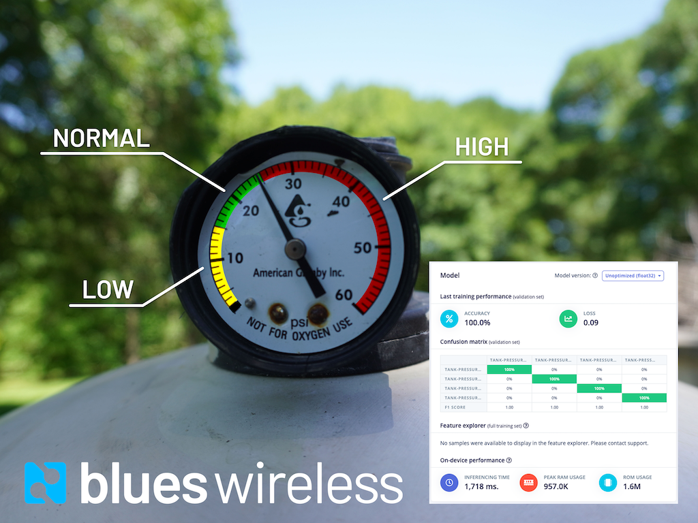

# Machine Vision Tank Monitor

An Edge ML and Cellular IoT Project for monitoring pressure on a pool filter tank. The [full project writeup is on Hackster.io](https://www.hackster.io/brandonsatrom/monitor-the-analog-world-with-tinyml-fd59c4).

This repository contains the complete Python source for a project that runs an [Edge Impulse](https://edgeimpulse.com)-created ML model and sends inference results to the Blues Wireless [Notecard](https://blues.io/products).

A public version of the Edge Impulse project, with downloadable model files is [here](https://studio.edgeimpulse.com/public/29302/latest).